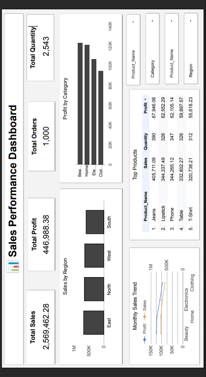

# 📊 Sales Performance Dashboard (Looker Studio)

## 🔍 Project Overview

This project presents a Sales Performance Dashboard built using Google Looker Studio. It provides insights into sales, profit, and customer trends.

## 📁 Dataset

* Contains order-level sales data
* Fields include: Order Date, Region, Category, Sales, Profit, Quantity

## 📊 Dashboard Features

* KPI Cards (Total Sales, Profit, Orders, Quantity)
* Sales by Region
* Profit by Category
* Monthly Sales Trend
* Top Products Analysis
* Interactive Filters

## 🛠 Tools Used

* Google Sheets
* Looker Studio

## 📸 Dashboard Preview

## 🔗 Live Dashboard

https://lookerstudio.google.com/reporting/e42bb8e0-e8dd-4c7c-845d-c6e14df56b94

## 💡 Key Insights

* East region has highest sales
* Electronics category generates high profit
* Seasonal spikes observed in Q4

## 🚀 Author

Shilpa Tumma
